**Udacity_Data_Engineer_Nanodegree**

This is a course from [Udacity](https://www.udacity.com/course/data-engineer-nanodegree--nd027).

**Contents:**
- [Part 1: Welcome to the Nanodegree Program](#part-1-welcome-to-the-nanodegree-program)
- [Part 2: Data Modeling](#part-2-data-modeling)
  - [2.1 Introduction to data modeling](#21-introduction-to-data-modeling)
  - [2.2 Relational data models with PostgreSQL database](#22-relational-data-models-with-postgresql-database)
  - [2.3 Project 1a: Data Modeling with Postgres](#23-project-1a-data-modeling-with-postgres)
  - [2.4 NoSQL data models with Apache Cassandra](#24-nosql-data-models-with-apache-cassandra)
  - [2.5 Project 1b: Data Modeling with Apache Cassandra](#25-project-1b-data-modeling-with-apache-cassandra)
- [Part 3: Cloud Data Warehouses](#part-3-cloud-data-warehouses)
- [Part 4: Data Lakes with Spark](#part-4-data-lakes-with-spark)
- [Part 5: Data Pipelines with Airflow](#part-5-data-pipelines-with-airflow)
- [Part 6: Capstone Project](#part-6-capstone-project)

## Part 1: Welcome to the Nanodegree Program 

## Part 2: Data Modeling 

This part includes: 

- Learning relational data models with PostgreSQL database. Learning NoSQL data models with Apache Cassandra.
    
- Project 1a: Data Modeling with Postgres. Modeling user activity data to create a database and ETL pipeline in Postgres for a music streaming app.
    
- Project 1b: Data Modeling with Apache Cassandra. Modeling event data to create a non-relational database and ETL pipeline for a music streaming app.

`Trick`: I use Windows 10, so installing Apache Cassandra could be tricky. I tried on my laptop and desktop. I installed it successfully on my laptop.

### 2.1 Introduction to data modeling

1. What is data modeling?
   

    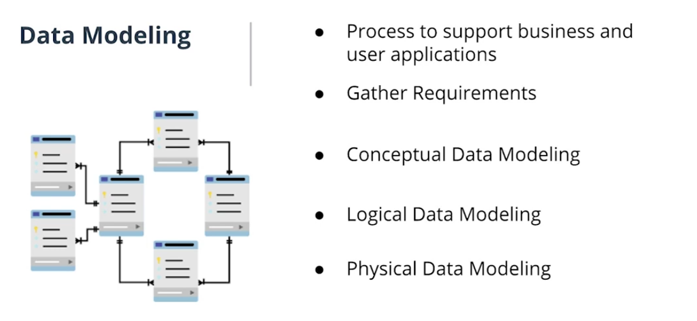
    

2. Intro to relational database
    

    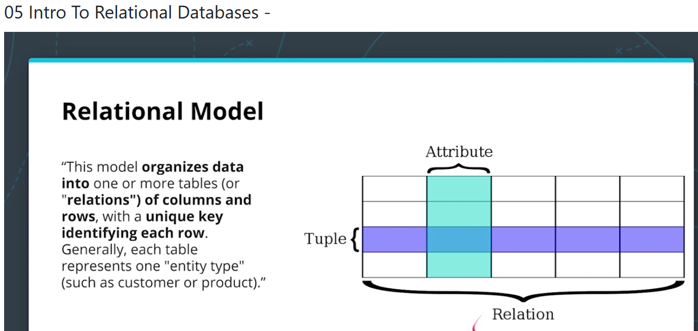
    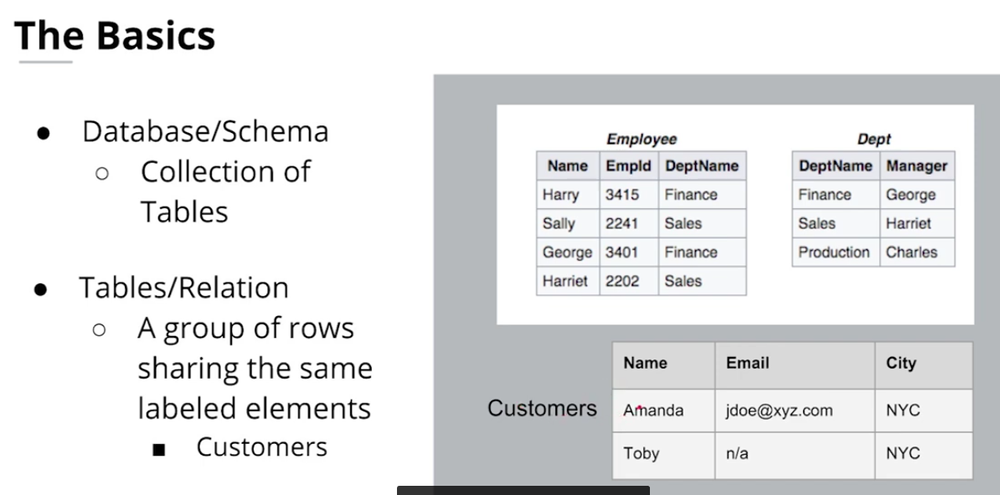
    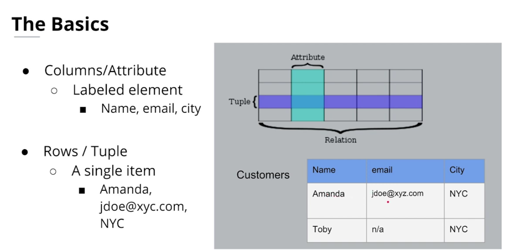

    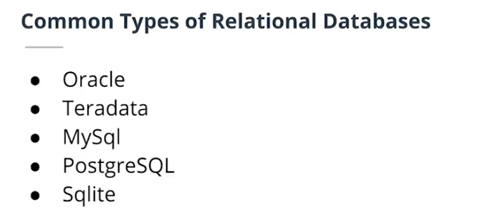
    

3. When to use relational database?
    

    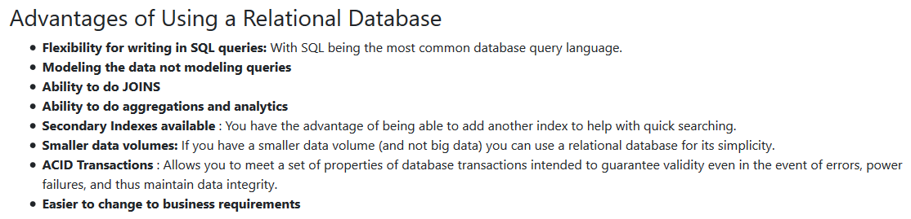
    

4. ACID transactions:
   

    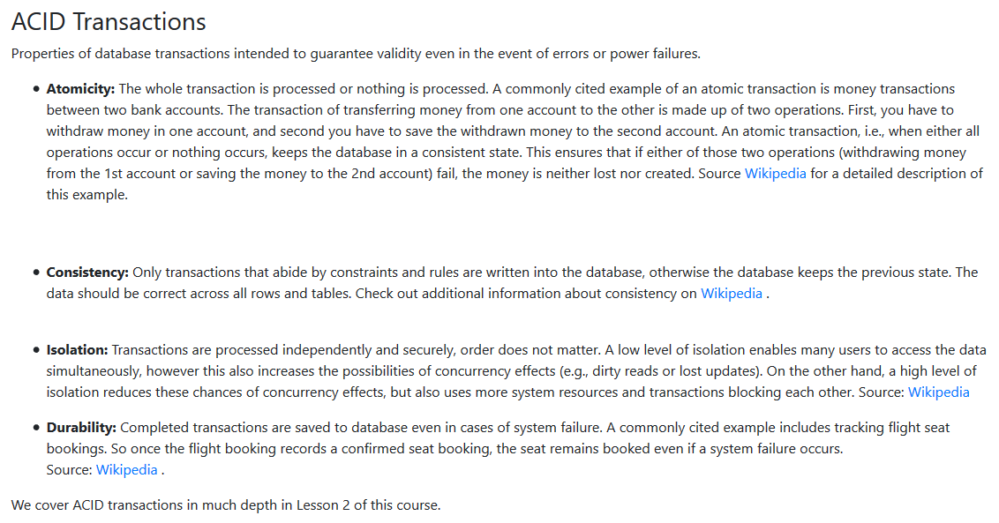
    

5. when not to use relational database?
   

    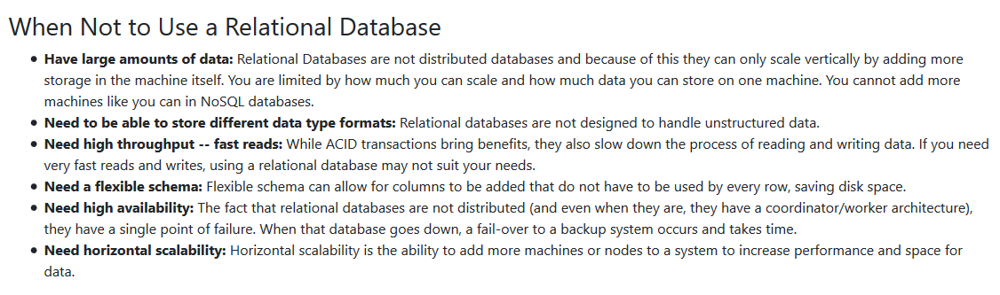
    

6. Introduction to NoSQL database
    

    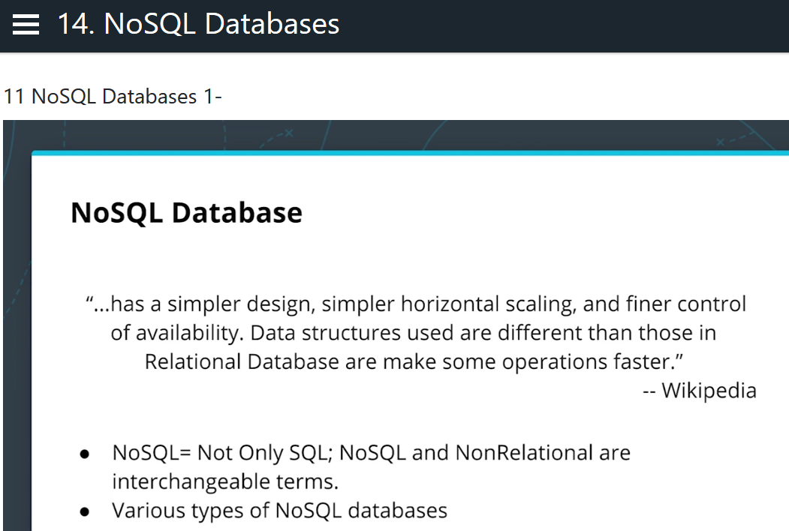

    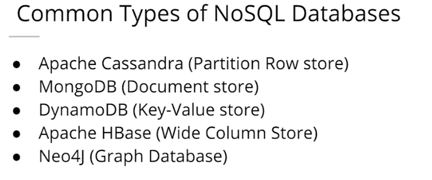
    

7. When to use NoSQL database?
   

    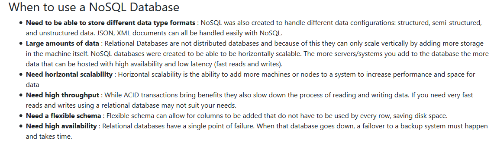
    

8. When not to use NoSQL database?
   

    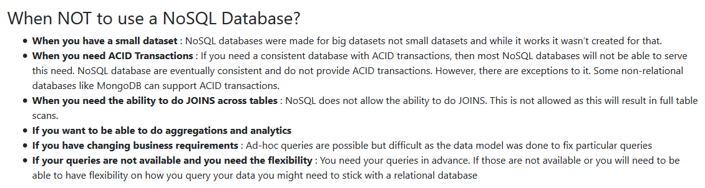
    

    There are some NoSQL databases that offer some form of ACID transaction, Such as MongoDB, MarkLogic.

9. The basics of Apache Cassandra
    

    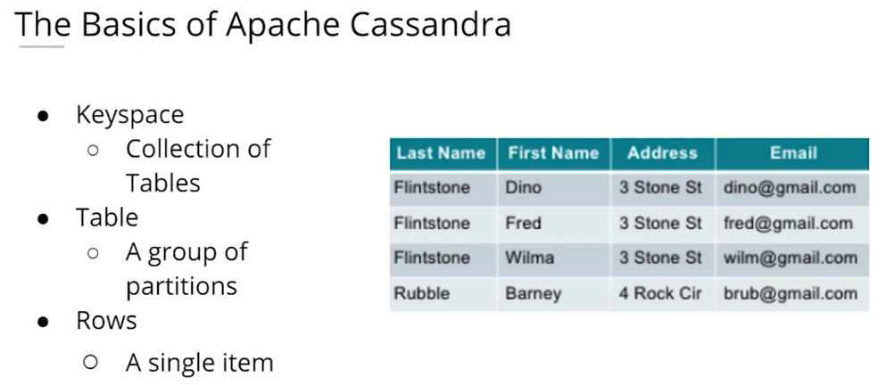
    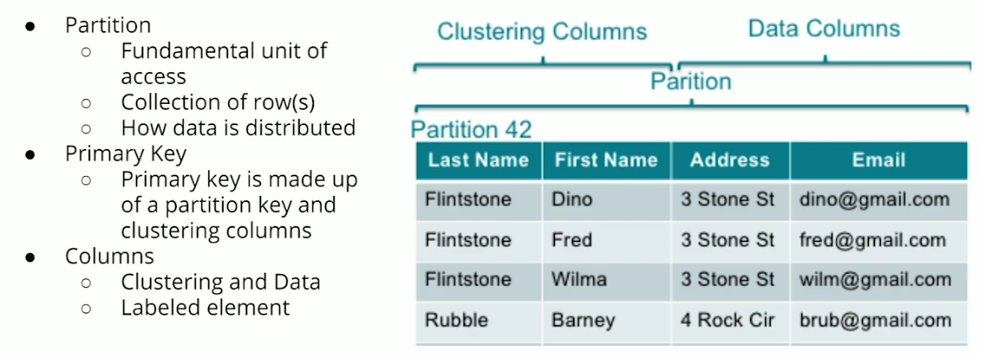
    

### 2.2 Relational data models with PostgreSQL database

### 2.3 Project 1a: Data Modeling with Postgres

### 2.4 NoSQL data models with Apache Cassandra

### 2.5 Project 1b: Data Modeling with Apache Cassandra

## Part 3: Cloud Data Warehouses 

**Content**: 

- Learning data warehouse on AWS.
    
- Project: Data Warehouse. Extracting data from S3, stages them in Redshift, and transforms data into a set of dimensional tables for their analytics team. 
    
`Trick`: All functions needed in this course come with free trial on AWS.

## Part 4: Data Lakes with Spark 

**Content**: 

- Learning Spark with AWS.
    
- Project: Data Lake. Building a data lake and an ETL pipeline in Spark that loads data from S3, processes the data into analytics tables, and loads them back into S3. 
    
`Trick`: I installed PySpark on windows 10. PySpark can work, but will pop up warning or wrong message. I switched to Google Colab, which worked withoug pain.

## Part 5: Data Pipelines with Airflow 

**Content**: 

- Learning data piplines on Apache Airflow.
    
- Project: Data Pipelines. Creating and automating a set of data pipelines with Airflow, monitoring and debugging production pipelines.

## Part 6: Capstone Project 

