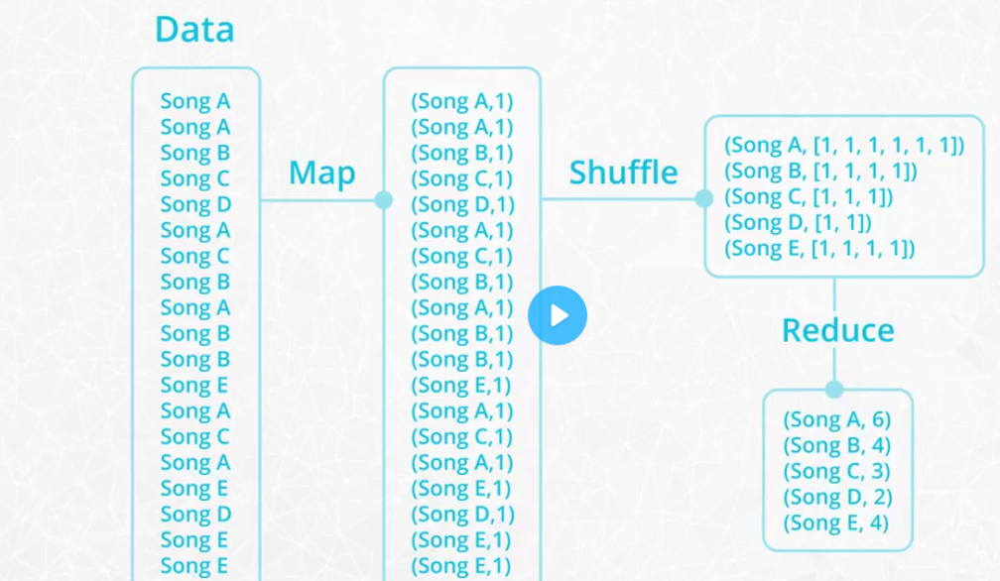
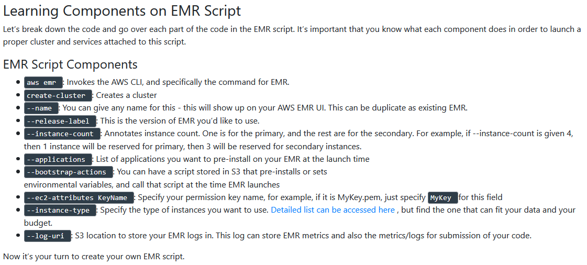

**Udacity_Data_Engineer_Nanodegree**

This is a course from [Udacity](https://www.udacity.com/course/data-engineer-nanodegree--nd027).

**Contents:**
- [Part 1: Welcome to the Nanodegree Program](#part-1-welcome-to-the-nanodegree-program)
- [Part 2: Data Modeling](#part-2-data-modeling)
  - [2.1 Introduction to data modeling](#21-introduction-to-data-modeling)
  - [2.2 Relational data models with PostgreSQL database](#22-relational-data-models-with-postgresql-database)
  - `[2.3 Project 1a: Data Modeling with Postgres](#23-project-1a-data-modeling-with-postgres)`
  - [2.4 NoSQL data models with Apache Cassandra](#24-nosql-data-models-with-apache-cassandra)
  - `[2.5 Project 1b: Data Modeling with Apache Cassandra](#25-project-1b-data-modeling-with-apache-cassandra)`
- [Part 3: Cloud Data Warehouses](#part-3-cloud-data-warehouses)
  - [3.1 Introduction to Data Warehouses](#31-introduction-to-data-warehouses)
  - [3.2 Introduction to Cloud Computing and AWS](#32-introduction-to-cloud-computing-and-aws)
  - [3.3 Implementing Data Warehouses on AWS](#33-implementing-data-warehouses-on-aws)
  - `[3.4 Project: Data Warehouse](#34-project-data-warehouse)`
- [Part 4: Data Lakes with Spark](#part-4-data-lakes-with-spark)
  - [4.1 The Power of Spark](#41-the-power-of-spark)
  - [4.2 Data Wrangling with Spark](#42-data-wrangling-with-spark)
  - [4.3 Setting up Spark Clusters with AWS](#43-setting-up-spark-clusters-with-aws)
  - [4.4 Debugging and Optimization](#44-debugging-and-optimization)
  - [4.5 Introduction to Data Lakes](#45-introduction-to-data-lakes)
  - `[4.6 Project: Data Lake.](#46-project-data-lake)`
- [Part 5: Data Pipelines with Airflow (unfinished)](#part-5-data-pipelines-with-airflow-unfinished)
- [Part 6: Capstone Project (unfinished)](#part-6-capstone-project-unfinished)

## Part 1: Welcome to the Nanodegree Program 

## Part 2: Data Modeling 

This part includes: 

- Learning relational data models with PostgreSQL database. Learning NoSQL data models with Apache Cassandra.
    
- Project 1a: Data Modeling with Postgres. Modeling user activity data to create a database and ETL pipeline in Postgres for a music streaming app.
    
- Project 1b: Data Modeling with Apache Cassandra. Modeling event data to create a non-relational database and ETL pipeline for a music streaming app.

`Trick`: I use Windows 10, so installing Apache Cassandra could be tricky. I tried on my laptop and desktop. I installed it successfully on my laptop.

### 2.1 Introduction to data modeling

1. What is data modeling?
   <p align="center">
    
    </p>

2. Intro to relational database
    <p align="center">
    
    
    

    
    </p>

3. When to use relational database?
    <p align="center">
    
    </p>

4. ACID transactions:
   <p align="center">
    
    </p>

5. when not to use relational database?
   <p align="center">
    
    </p>

6. Introduction to NoSQL database
    <p align="center">
    

    
    </p>

7. When to use NoSQL database?
   <p align="center">
    
    </p>

8. When not to use NoSQL database?
   <p align="center">
    
    </p>

    There are some NoSQL databases that offer some form of ACID transaction, Such as MongoDB, MarkLogic.

9. The basics of Apache Cassandra
    <p align="center">
    
    
    </p>

### 2.2 Relational data models with PostgreSQL database

1. OLAP vs OLTP
   <p align="center">
    
    </p>

2. Normalization
    <p align="center">
    
    </p>
3. Normal Form
   <p align="left">
    
    
    
    
    
    </p>

4. Denormalization
   <p align="center">
    
    </p>

5. Fact and Dimension Tables 
   <p align="center">
    
    
    </p>

6. Star Schema vs Snowflake Schema
- Star Schema
  <p align="left">
    
    
    
    </p>

- Snowflake Schema
  <p align="left">
    
    
    </p>

- Comparison
  <p align="center">
    
    </p>

7. Some important constraints and clauses
- NOT NULL
- UNIQUE
- PRIMARY KEY
- ON CONFLICT DO NOTHING
- ON CONFLICT DO UPDATE

### 2.3 Project 1a: Data Modeling with Postgres

Check the blog [here](https://ycheng22.github.io/Data_Modeling_with_PostgreSQL/)

### 2.4 NoSQL data models with Apache Cassandra

1. When to use NoSQL
    <p align="center">
    
    </p>

2. Apache Cassandra
   <p align="center">
    
    </p>

3. CAP Theroem
   <p align="left">
    
    
    </p>

    According to the CAP theorem, a database can actually only guarantee two out of the three in CAP. So supporting Availability and Partition Tolerance makes sense, since Availability and Partition Tolerance are the biggest requirements. 

4. Denormalization
   <p align="left">
    
    
    
    </p>

5. CQL
   <p align="center">
    
    </p>

6. Primary Key
   <p align="left">
    
    
    
    
    
    </p>

7. Clustering Columns
   
	- The clustering column will sort the data in sorted **ascending** order, e.g., alphabetical order. Note: this is a mistake in the video, which says descending order. 
	- More than one clustering column can be added (or none!) 
    - From there the clustering columns will sort in order of how they were added to the primary key 
    <p align="left">
    
    
    </p>

8. Where Clause
    <p align="left">
    
    
    
    </p>

### 2.5 Project 1b: Data Modeling with Apache Cassandra

Check the blog [here](https://ycheng22.github.io/Data_Modeling_with_Apache_Cassandra/).

## Part 3: Cloud Data Warehouses 

This part includes: 
- Introduction to Data Warehouses 
- Introduction to Cloud Computing and AWS 
- Implementing Data Warehouses on AWS 
- Project: Data Warehouse. Extracting data from S3, stages them in Redshift, and transforms data into a set of dimensional tables for their analytics team.   

### 3.1 Introduction to Data Warehouses 

1. Introduction
   <p align="center">
    
    </p>

2. Data warehouse in business perspective
   <p align="left">
    
    
    </p>

3. Operational vs Analytical business process
   <p align="left">
    
    
    
    </p>

4. Data warehouse in technical perspective
    <p align="left">
    
    
    
    
    
    
    </p>

5. Facts and Dimensions table
   <p align="left">
    
    
    
    </p>

6. DWH Architecture: Kimball's Bus Architecture 
   <p align="left">
    
    </p>

7. DWH Architecture: Independent Data Marts 
   <p align="left">
    
    
    </p>

8. DWH Architecture: Corporate Information Factory(CIF) 
   <p align="left">
    
    
    
    </p>

9.  DWH Architecture: Hybrid Bus & CIF 
    <p align="left">
    
    </p>

10. OLAP Cubes and Operations
    <p align="left">
    
    
    
    
    
    </p>

### 3.2 Introduction to Cloud Computing and AWS 

### 3.3 Implementing Data Warehouses on AWS 

1. Data Warehouse on AWS
   <p align="left">
    
    </p>

2. DWH Dimensional Model storage on AWS
    <p align="left">
    
    
    </p>

3. Amazon Redshift Technology
   <p align="left">
    
    
    
    </p>

4. Redshift Architecture
   <p align="left">
    
    
    
    
    
    </p>

5. SQL-to-SQL ETL
   <p align="left">
    
    
    
    
    </p>

6. Redshift & ETL in Context
   <p align="left">
    
    
    
    
    </p>

7. Ingesting at scale
   <p align="left">
    
    </p>

8. Redshift Cluster quick launcher'
   <p align="left">
    
    
    
    
    </p>

9. Problems with quick launcher
    <p align="left">
    
    
    </p>

10. Infrastructure as Code on AWS
    <p align="left">
    
    
    
    
    
    </p>

    Code Example:
    <p align="left">
    
    
    
    </p>

11. Enabling programmatic access
    <p align="left">
    
    
    </p>

12. Optimizing table desing
    <p align="left">
    
    </p>

13. Distribution style
    <p align="left">
    
    </p>

    - EVEN
        <p align="left">
        
        
        </p>

    - ALL
        <p align="left">
        
        
        </p>

    - AUTO
        <p align="left">
        
        </p>

    - KEY
        <p align="left">
        
        
        
        
        </p>

14. Sorting key
    <p align="left">
    
    
    
    </p>


### 3.4 Project: Data Warehouse

Check the blog [here](https://ycheng22.github.io/Data_Warehouse_with_AWS/)

## Part 4: Data Lakes with Spark 

This part includes: 

- The Power of Spark, the problems that Apache Spark is designed to solve
- Data Wrangling with Spark, how to use Spark for cleaning and aggregating data
- Setting up Spark Clusters with AWS, learn to run Spark on a distributed cluster in AWS UI and AWS CLI
- Debugging and Optimization, practices for debugging and optimizing Spark applications. 
- Introduction to Data Lakes
- Project: Data Lake. Building a data lake and an ETL pipeline in Spark that loads data from S3, processes the data into analytics tables, and loads them back into S3. 
    
`Trick`: I installed PySpark on windows 10. PySpark can work, but will pop up warning or wrong message. I switched to Google Colab, which worked withoug pain.

### 4.1 The Power of Spark

1. Distributed and parallel computing system
   <p align="left">
    
    
    </p>

2. Hadoop Ecosystem
   <p align="left">
    
    
    </p>

3. How is Spark related to Hadoop? 
    Spark, which is the main focus of this course, is another big data framework. Spark contains libraries for data analysis, machine learning, graph analysis, and streaming live data. Spark is generally faster than Hadoop. This is because Hadoop writes intermediate results to disk whereas Spark tries to keep intermediate results in memory whenever possible. 
    The Hadoop ecosystem includes a distributed file storage system called HDFS (Hadoop Distributed File System). Spark, on the other hand, does not include a file storage system. You can use Spark on top of HDFS but you do not have to. Spark can read in data from other sources as well such as Amazon S3 . 
4. Streaming Data 
    Data streaming is a specialized topic in big data. The use case is when you want to store and analyze data in real-time such as Facebook posts or Twitter tweets. 
    Spark has a streaming library called Spark Streaming although it is not as popular and fast as some other streaming libraries. Other popular streaming libraries include Storm and Flink . Streaming won't be covered in this course, but you can follow these links to learn more about these technologies. 

5. MapReduce
   
   MapReduce is a programming technique for manipulating large data sets. "Hadoop MapReduce" is a specific implementation of this programming technique. 
    The technique works by first dividing up a large dataset and distributing the data across a cluster. In the map step, each data is analyzed and converted into a (key, value) pair. Then these key-value pairs are shuffled across the cluster so that all keys are on the same machine. In the reduce step, the values with the same keys are combined together. 
    While Spark doesn't implement MapReduce, you can write Spark programs that behave in a similar way to the map-reduce paradigm.
    <p align="left">
    
    
    
    
    </p>

6. Spark cluster configuration
   <p align="left">
    
    </p>

7. Spark Use Cases and Resources 
   
   Here are a few resources about different Spark use cases: 
	- [Data Analytics](https://spark.apache.org/sql/) 
	- [Machine Learning](https://spark.apache.org/mllib/) 
	- [Streaming](https://spark.apache.org/streaming/) 
    - [Graph Analytics](https://spark.apache.org/graphx/) 

8. Spark's Limitations 
    Spark has some limitation. 
    Spark Streaming’s latency is at least 500 milliseconds since it operates on micro-batches of records, instead of processing one record at a time. Native streaming tools such as Storm , Apex , or Flink can push down this latency value and might be more suitable for low-latency applications. Flink and Apex can be used for batch computation as well, so if you're already using them for stream processing, there's no need to add Spark to your stack of technologies. 
    Another limitation of Spark is its selection of machine learning algorithms. Currently, Spark only supports algorithms that scale linearly with the input data size. In general, deep learning is not available either, though there are many projects integrate Spark with Tensorflow and other deep learning tools. 

9. You Don't Always Need Spark 
    Spark is meant for big data sets that cannot fit on one computer. But you don't need Spark if you are working on smaller data sets. In the cases of data sets that can fit on your local computer, there are many other options out there you can use to manipulate data such as: 
        - AWK - a command line tool for manipulating text files 
        - R - a programming language and software environment for statistical computing 
        - Python PyData Stack , which includes pandas, Matplotlib, NumPy, and scikit-learn among other libraries 
    Sometimes, you can still use pandas on a single, local machine even if your data set is only a little bit larger than memory. Pandas can read data in chunks. Depending on your use case, you can filter the data and write out the relevant parts to disk. 
    If the data is already stored in a relational database such as MySQL or Postgres , you can leverage SQL to extract, filter and aggregate the data. If you would like to leverage pandas and SQL simultaneously, you can use libraries such as SQLAlchemy , which provides an abstraction layer to manipulate SQL tables with generative Python expressions. 
    The most commonly used Python Machine Learning library is scikit-learn . It has a wide range of algorithms for classification, regression, and clustering, as well as utilities for preprocessing data, fine tuning model parameters and testing their results. However, if you want to use more complex algorithms - like deep learning - you'll need to look further. TensorFlow and PyTorch are currently popular packages. 

10. Hadoop versus Spark 
    The Hadoop ecosystem is a slightly older technology than the Spark ecosystem. In general, Hadoop MapReduce is slower than Spark because Hadoop writes data out to disk during intermediate steps. However, many big companies, such as Facebook and LinkedIn, started using Big Data early and built their infrastructure around the Hadoop ecosystem. 
    While Spark is great for iterative algorithms, there is not much of a performance boost over Hadoop MapReduce when doing simple counting. Migrating legacy code to Spark, especially on hundreds of nodes that are already in production, might not be worth the cost for the small performance boost. 

11. Beyond Spark for Storing and Processing Big Data 
    Keep in mind that Spark is not a data storage system, and there are a number of tools besides Spark that can be used to process and analyze large datasets. 
    Sometimes it makes sense to use the power and simplicity of SQL on big data. For these cases, a new class of databases, know as NoSQL and NewSQL, have been developed. 
    For example, you might hear about newer database storage systems like HBase or Cassandra . There are also distributed SQL engines like Impala and Presto . Many of these technologies use query syntax that you are likely already familiar with based on your experiences with Python and SQL. 
    In the lessons ahead, you will learn about Spark specifically, but know that many of the skills you already have with SQL, Python, and soon enough, Spark, will also be useful if you end up needing to learn any of these additional Big Data tools. 

### 4.2 Data Wrangling with Spark

1. Functional programming
   <p align="left">
    
    
    
    </p>
    `PySpark` API is written with functional programming principles.

2. DAG
   <p align="left">
    
    </p>

3. A Spark program
   <p align="left">
    
    
    </p>

### 4.3 Setting up Spark Clusters with AWS

1. Overview of the Set up of a Spark Cluster 
	- `Amazon S3` will store the dataset. 
	- We rent a cluster of machines, i.e., our `Spark Cluster` , and it's located in AWS data centers. We rent these using AWS service called `Elastic Compute Cloud (EC2)`. 
	- We log in from your local computer to this Spark cluster. 
	- Upon running our Spark code, the cluster will load the dataset from `Amazon S3` into the cluster’s memory distributed across each machine in the cluster. 

2. Local mode vs Standalone mode
   
    - Local mode : You are running a Spark program on your laptop like a single machine.
    - Standalone mode : You are defining Spark Primary and Secondary to work on your (virtual) machine. You can do this on EMR or your machine. Standalone mode uses a resource manager like YARN or Mesos.

3. Setup Instructions AWS
   <p align="left">
    
    
    
    </p>

    Please refer to the latest [AWS documentation to set up an EMR Cluster](https://docs.aws.amazon.com/emr/latest/ManagementGuide/emr-gs-launch-sample-cluster.html).

4. AWS CLI
   <p align="left">
    
    
    
    </p>

5. IAM setup
   <p align="left">
    
    </p>

6. Storing Key Pairs 
   <p align="left">
    
    
    </p>

7. Creating EMR Script
   
   While creating EMR through AWS console has been shown, but if you know the specificity of your instances, such as which applications you need or what kind of clusters you’ll need, you can reuse the EMR script that we will create below multiple times. 
   ```python
    aws emr create-cluster --name <cluster_name> \
    --use-default-roles --release-label emr-5.28.0  \
    --instance-count 3 --applications Name=Spark Name=Zeppelin  \
    --bootstrap-actions Path="s3://bootstrap.sh" \
    --ec2-attributes KeyName=<your permission key name> \
    --instance-type m5.xlarge --log-uri s3:///emrlogs/
   ```

   <p align="left">
    
    </p>

8. AWS S3
   <p align="left">
    
    
    </p>

9. S3 Buckets
    <p align="left">
    
    </p>

10. Differences between HDFS and AWS S3
    <p align="left">
    
    </p>

### 4.4 Debugging and Optimization

1. Accumulators
   <p align="left">
    
    </p>

2. Spark Broadcast
   <p align="left">
    
    
    </p>

3. Different types of Spark Functions 
   <p align="left">
    
    </p>

4. Data skew
   <p align="left">
    
    
    
    </p>

5.  Further reading

    Debugging and tuning your Spark application can be a daunting task. There is an ever-growing community out there though, always sharing new ideas and working on improving Spark and its tooling, to make using it easier. So if you have a complicated issue don’t hesitate to reach out to others (via user mailing lists, forums, and Q&A sites).

    You can find more information on tuning 
    - [Spark](https://spark.apache.org/docs/latest/tuning.html)
    - [Spark SQL]( https://spark.apache.org/docs/latest/sql-performance-tuning.html)

### 4.5 Introduction to Data Lakes

1. Data lakes
   <p align="left">
    
    </p>

2. Why data lakes: evelotion of data warehouse
   <p align="left">
    
    
    </p>

3. Why data lakes: Unstructured & Big data
   <p align="left">
    
    
    </p>    

4. Why data lakes: New role & advanced analytics
   <p align="left">
    
    
    </p> 

5. Big data effect 1: Low Costs, ETL Offloading 
   <p align="left">
    
    </p> 

6. Big data effect 2: Schema-On-Read 
    <p align="left">
    
    
    
    
    
    </p> 

6. Big data effect 3: (Un--Semi-)Structured Support 
   <p align="left">
    
    </p>

7. Data lake concepts
   <p align="left">
    
    
    
    
    </p> 

8. Data Lake Vs Data Warehouse 
   <p align="left">
    
    
    </p>

9. Data Lake Options On AWS 
    <p align="left">
    
    
    
    
    </p>    

10. DataLakeIssues 
    <p align="left">
    
    </p>

### 4.6 Project: Data Lake.

Check the blog [here](https://ycheng22.github.io/Data_Lakes_with_Spark/).

## Part 5: Data Pipelines with Airflow (unfinished)

**Content**: 

- Learning data piplines on Apache Airflow.
    
- Project: Data Pipelines. Creating and automating a set of data pipelines with Airflow, monitoring and debugging production pipelines.

##  Part 6: Capstone Project (unfinished)


